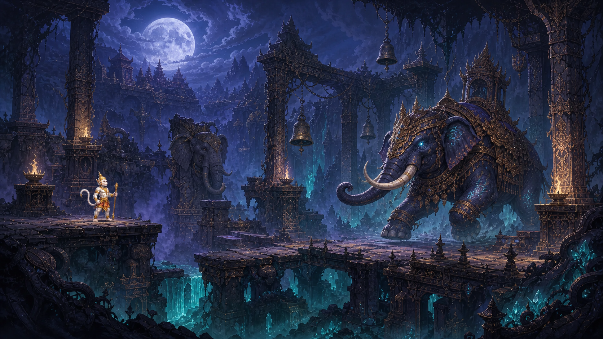
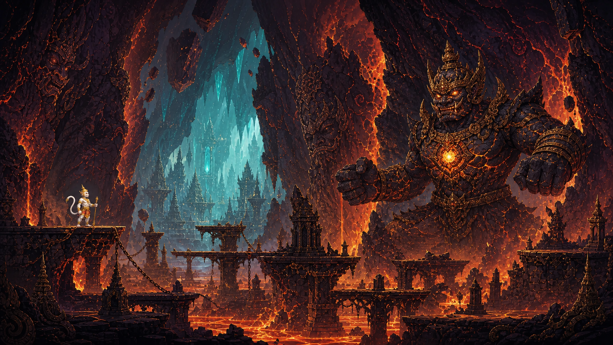
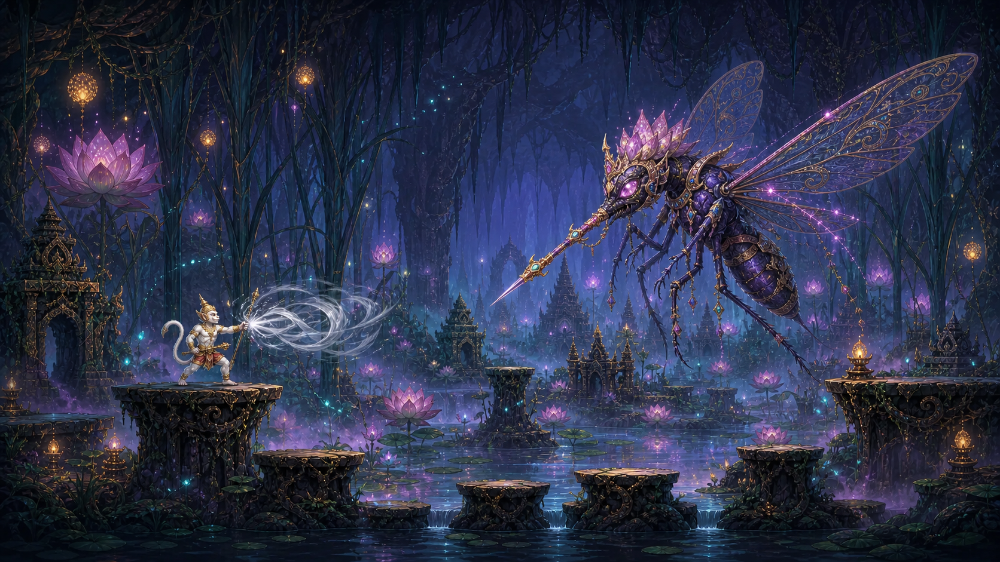
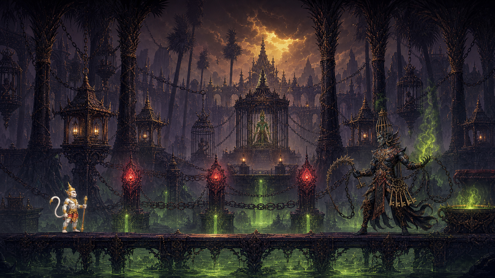

# แนวคิดขยายเกมเป็น 7 ด่าน

สถานะ: **อนุมัติและนำไปพัฒนาแล้ว — 2026-07-28**

เป้าหมายคือเพิ่ม 4 ด่านระหว่างด่านแรกกับด่านสุดท้าย โดยรักษาด่านเดิมและแกนเรื่อง “ศึกไมยราพ” ไว้ครบ ด่านใหม่ใช้เหตุการณ์ระหว่างทางลงเมืองบาดาลเป็นฐาน แล้วออกแบบบอสใหม่สำหรับเกมโดยเฉพาะ

## ลำดับด่านที่เสนอ

| ลำดับใหม่ | ด่าน | บอส | สถานะ |
|---:|---|---|---|
| 1 | รัตติกาลเหนือค่ายพระราม | นายทวารรัตติกาล | ด่านเดิม |
| 2 | ช่องผาคชสารคลั่ง | พญาคชสารเมฆา | ด่านใหม่ |
| 3 | ภูผากระทบอัคนี | ทวารศิลาอัคนี | ด่านใหม่ |
| 4 | พงไพรมศกอสูร | นางพญามศกทมิฬ | ด่านใหม่ |
| 5 | สระบัวแห่งมัจฉานุ | มัจฉานุ | ด่านเดิม ย้ายลำดับจาก 2 เป็น 5 |
| 6 | ดงตาลกรงเหล็ก | ขุนทัณฑ์เหล็ก | ด่านใหม่ |
| 7 | พระนครบาดาล | ไมยราพ | ด่านเดิม ย้ายลำดับจาก 3 เป็น 7 |

ชื่อบอสใหม่ทั้งหมดเป็นชื่อสำหรับฉบับเกม ไม่ได้นำเสนอว่าเป็นตัวละครเดิมในวรรณคดี ส่วนแกนของด่านช้างตกมัน ภูเขากระทบเป็นไฟ ยุงยักษ์ มัจฉานุ และดงตาล อิงลำดับเหตุการณ์ที่เล่าไว้ในตอนศึกไมยราพ

## หลักการร่วมของด่านใหม่

- ด่านละประมาณ 6–9 นาที เพื่อไม่ให้เกมที่ขยายเป็น 7 ด่านยาวเกินไป
- ใช้ปุ่มและความสามารถเดิมทั้งหมด ไม่เพิ่มปุ่มใหม่บนมือถือ
- ความยากมาจากการนำ dash, double jump และพลังวายุไปใช้ในสถานการณ์ใหม่
- ด่านละ 2 checkpoint และอีก 1 checkpoint ก่อนบอส
- บอสมีไม่เกิน 2 phase มีสัญญาณเตือนด้วยท่าทาง แสง และเสียงที่อ่านง่าย
- ศัตรูทั่วไปพร้อมกันไม่เกิน 6–8 ตัว และลด particle ได้ในโหมดคุณภาพต่ำ
- บอสและศัตรูสลายเป็นควัน/เศษแสง ไม่มีเลือดหรือความรุนแรงสมจริง

---

## ด่าน 2 — ช่องผาคชสารคลั่ง

**บทบาทในเรื่อง:** หลังเปิดประตูบาดาล หนุมานลงสู่ช่องผาที่ถูกฝูงช้างต้องมนตร์ใช้เป็นแนวป้องกัน

**ภาพและบรรยากาศ**

- สะพานหินราชสำนักแตกหัก เสาแกะลายไทย ระฆังทองแดง และเหวผลึกสีฟ้า
- สียังคงรับจากด่านแรกด้วยน้ำเงินจันทร์และม่วงควัน ก่อนค่อยเปลี่ยนเป็นแสง teal ของถ้ำบาดาล
- เงาช้างด้านหลังใช้สร้างแรงกดดัน ส่วนเส้นทางหลักยังอ่านง่ายในมุม side-on

**จังหวะด่าน**

1. ช่วงเรียนรู้: ช้างพุ่งตัดทางเป็น hazard ผู้เล่นอ่านเสียงระฆังและฝุ่นก่อน dash หลบ
2. ช่วงกลาง: หลอกให้ช้างชนเสาหินเพื่อเปิดทางหรือสร้าง platform ใหม่
3. ช่วงก่อนบอส: สะพานแคบสลับกับแท่นสูง บังคับใช้ jump + dash โดยไม่ต้องกดปุ่มซับซ้อน

**บอส — พญาคชสารเมฆา**

- รูปลักษณ์: ช้างศึกมนตร์สีน้ำเงินคราม งาทองขาว เกราะทองแดงลายกนก และดวงตาแสงฟ้า
- Phase 1: พุ่งเป็นแนวตรง กระทืบสร้างคลื่น และสะบัดเศษหิน
- จุดโต้กลับ: หลอกให้ชนเสาศิลา เกราะหน้าผากจะแตกและเผยตราเวท
- Phase 2: สนามบางส่วนพังเป็นหลุม บอสเพิ่มการพุ่งกลับทิศ แต่สัญญาณเตือนยาวขึ้นเพื่อชดเชยพื้นที่แคบ
- จบบอส: มนตร์คลาย ช้างสงบและเปิดทางลงถ้ำ ไม่สื่อว่าหนุมานทำร้ายสัตว์จนตาย

---

## ด่าน 3 — ภูผากระทบอัคนี

**บทบาทในเรื่อง:** ทางลงถูกขนาบด้วยภูเขาหินที่กระทบกันเป็นเปลวไฟ หนุมานต้องจับจังหวะผ่านก่อนช่องทางปิด

**ภาพและบรรยากาศ**

- หน้าผาหินดำมีใบหน้ายักษ์และลายกนกแกะสลัก รอยแยกด้านในสว่างด้วยลาวาส้ม
- ปลายทางเห็นแสงถ้ำผลึกสี teal ช่วยบอกทิศและเชื่อมเข้าด่านถัดไป
- เงาดำกับส้มอัคนีทำให้ด่านนี้มีอัตลักษณ์ต่างจากฉากน้ำเงินและสระบัว

**จังหวะด่าน**

1. ช่วงเรียนรู้: ผนังบีบช้า มีลายทองสว่างเป็น countdown ก่อนกระแทก
2. ช่วงกลาง: platform หินเคลื่อนขึ้นจากลาวา สลับจุดพักที่ปลอดภัย
3. ช่วงไล่ล่า: กล้องเร่งเล็กน้อยแต่ไม่ zoom ฉับพลัน ผู้เล่นใช้ dash ข้ามช่องก่อนภูผาปิด

**บอส — ทวารศิลาอัคนี**

- รูปลักษณ์: อสูรศิลาหลอมเหลวขนาดยักษ์ เศษเกราะวิหารทองแดง และแกนอัคนีกลางอก
- Phase 1: หมัดทุบพื้นสร้างเสาไฟ กวาดแขนช้า และปล่อยหินตกจากตำแหน่งที่มีเงาเตือน
- จุดโต้กลับ: หลังทุบสองครั้งติดกัน แกนอัคนีจะเปิดให้โจมตี
- Phase 2: ผนังสองข้างค่อย ๆ เคลื่อนเข้ามา ทำให้ arena แคบลง แต่บอสลดความถี่ของหินตก
- จบบอส: แกนอัคนีแตกเป็นเศษแสง ช่องภูผาหยุดและเปิดทางสู่พงไพรใต้ดิน

---

## ด่าน 4 — พงไพรมศกอสูร

**บทบาทในเรื่อง:** ป่าชื้นใต้บาดาลเต็มไปด้วยยุงยักษ์และหมอกนิทรา เป็นด่านที่ทดสอบการต่อสู้กลางอากาศก่อนถึงสระบัวของมัจฉานุ

**ภาพและบรรยากาศ**

- กออ้อและรากบัวขนาดยักษ์ บึงเงามืด ศาลาร้าง และละอองเรืองแสงสี amber
- ใช้ teal, indigo, ม่วง และชมพูบัว เพื่อเชื่อมภาพเข้าด่านมัจฉานุโดยตรง
- ฝูงยุงแสดงเป็นริ้วเงาในระยะไกล ไม่ใช้ภาพแมลงระยะใกล้ที่ชวนสยอง

**จังหวะด่าน**

1. ช่วงเรียนรู้: ฝูงยุงทำหน้าที่เหมือนกำแพงเคลื่อนที่ ใช้พลังวายุเป่าให้เกิดช่องปลอดภัยชั่วคราว
2. ช่วงกลาง: ก้านบัวเด้งตัวและแท่นลอยบังคับให้ต่อสู้กลางอากาศ
3. ช่วงก่อนบอส: เลือกเส้นทางจากโคมละอองสีทอง ระหว่างทางผิดมีหมอกนิทราที่ค่อย ๆ ลดพลังวายุแทนการฆ่าทันที

**บอส — นางพญามศกทมิฬ**

- รูปลักษณ์: นางพญายุงมนตร์ เกราะเปลือกสีคราม ปีกโปร่งลายกนก เครื่องประดับทอง และปลายปากเป็นหอกเวท
- Phase 1: พุ่งแทงเป็นเส้นตรง ยิงละอองแสง และสร้างกระแสลมจากปีก
- จุดโต้กลับ: พลังวายุสลายเกราะฝูงรอบตัว ทำให้บอสชะงักและตกลงมาในระยะโจมตี
- Phase 2: บอสสลับเกาะก้านบัวกับบินโฉบ รูปแบบเร็วขึ้นแต่ลดจำนวน projectile
- จบบอส: ฝูงแมลงแตกเป็นแสงหิ่งห้อย หมอกเปิดให้เห็นสระบัวของมัจฉานุ

---

## ด่าน 6 — ดงตาลกรงเหล็ก

**บทบาทในเรื่อง:** หลังมัจฉานุบอกทางเป็นนัย หนุมานพบพิรากวน ลอบเข้าเมือง และตามไปยังดงตาลท้ายเมืองเพื่อช่วยพระรามก่อนย้อนกลับไปปราบไมยราพ

**ภาพและบรรยากาศ**

- ป่าตาลดำกลายเป็นคุกหลวง กรงเหล็กแขวนด้วยโซ่ ศาลาคุมขังทองแดง และทางส่งยานิทราสีเขียว
- ใช้ม่วงดำ ทองแดง แดงตราผนึก และเขียวพิษ ก่อนเผยแสงทองพายุของพระราชวังสุดท้ายในฉากหลัง
- กรงพระรามอยู่แกนกลางภาพ ทำให้เป้าหมายของด่านเข้าใจได้ทันที

**จังหวะด่าน**

1. ช่วงลอบเข้าเมือง: cutscene สั้นให้หนุมานแปลงเป็นใยบัวติดสไบพิรากวน โดยไม่เพิ่มระบบ stealth เต็มรูปแบบ
2. ช่วงคุก: ทำลายตราผนึก 3 จุด แต่ละจุดเปิดทางและเรียก encounter ขนาดสั้น
3. ช่วงช่วยพระราม: ปิดท่อยานิทราและทำลายโซ่หลักก่อนเข้าสู้บอส

**บอส — ขุนทัณฑ์เหล็ก**

- รูปลักษณ์: นายคุกยักษ์รูปร่างสูงเพรียว มงกุฎทรงซี่กรง อาวุธโซ่ตะขอ พวงกุญแจพิธีกรรม และเวทพันธนาการสีเขียว
- Phase 1: เหวี่ยงโซ่เป็นวง ดึงผู้เล่น และปักตะขอสร้างแนวเขตอันตราย
- จุดโต้กลับ: dash ตัดสมอโซ่ที่ปักพื้น เมื่อขาดครบสองจุดบอสจะเสียสมดุล
- Phase 2: บอสผูกโซ่กับเสาตราผนึกสามต้น ผู้เล่นเลือกทำลายต้นใดก่อนเพื่อลดท่าของบอส
- จบบอส: โซ่และมนตร์สลาย หนุมานช่วยพระรามและพาไปฝากไว้ที่เขาสุรกานต์ผ่านภาพเล่าเรื่องสั้น ก่อนย้อนเข้าพระนครบาดาล

---

## การไหลของสีและอารมณ์

1. ด่าน 1–2: น้ำเงินจันทร์ / ม่วงควัน — เริ่มการไล่ตาม
2. ด่าน 3: ส้มอัคนี / หินดำ — จุดพีกด้าน platform timing
3. ด่าน 4–5: teal / indigo / ชมพูบัว — ความพิศวงและการพบมัจฉานุ
4. ด่าน 6: ม่วงดำ / เขียวพิษ / แดงผนึก — ภารกิจช่วยพระราม
5. ด่าน 7: ทองพายุ / ดำม่วง / เขียวดวงใจ — ศึกตัดสิน

## จุดที่ต้องอนุมัติก่อนเริ่มพัฒนา

1. ลำดับ 7 ด่านและการย้ายมัจฉานุไปด่าน 5
2. ชื่อด่านและชื่อบอสใหม่
3. รูปลักษณ์ของบอสทั้ง 4 จาก concept board
4. การให้ด่าน 6 จบด้วยการช่วยพระรามก่อนเข้าสู้ไมยราพ
5. ระยะเวลาเป้าหมาย 6–9 นาทีต่อด่านใหม่
